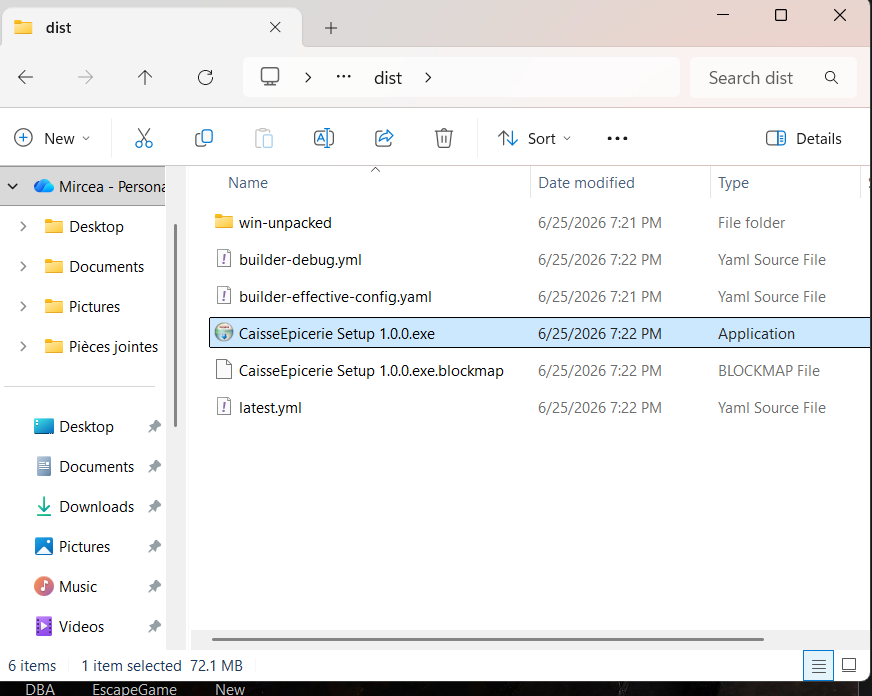
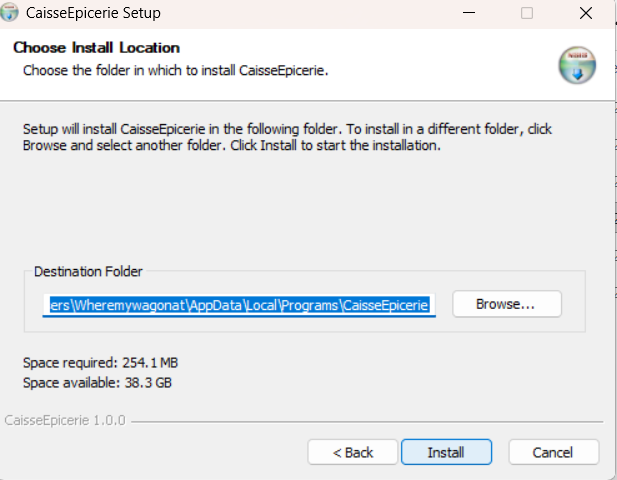
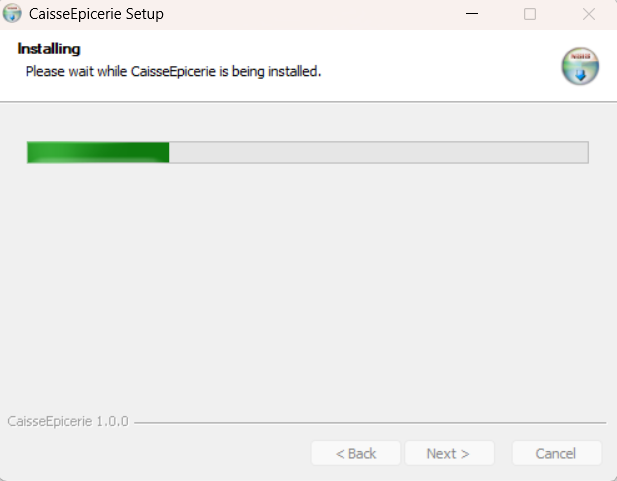
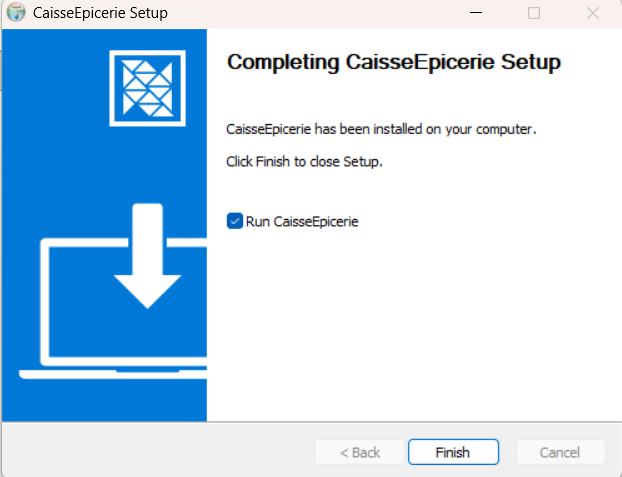
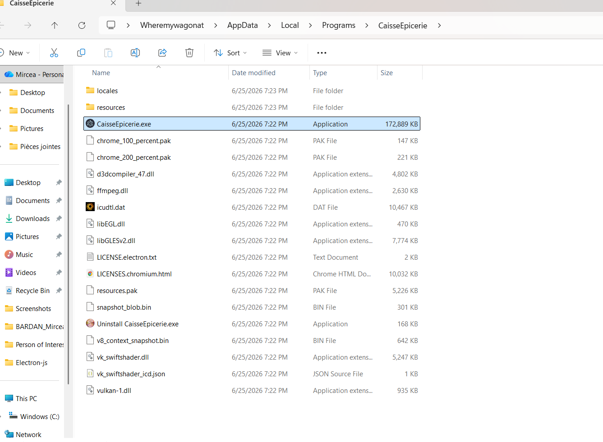
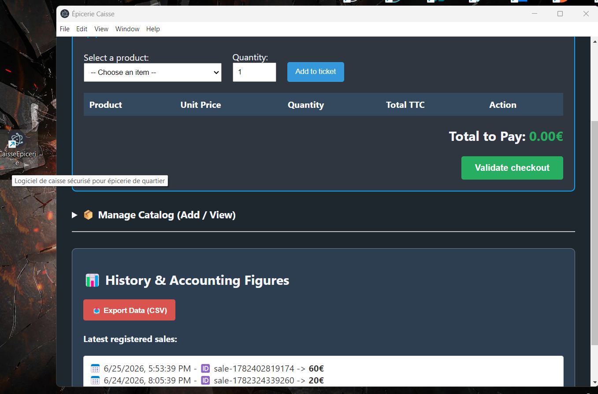
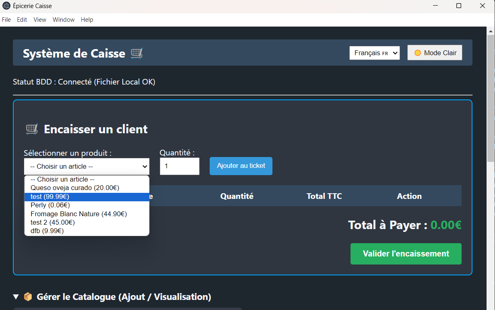
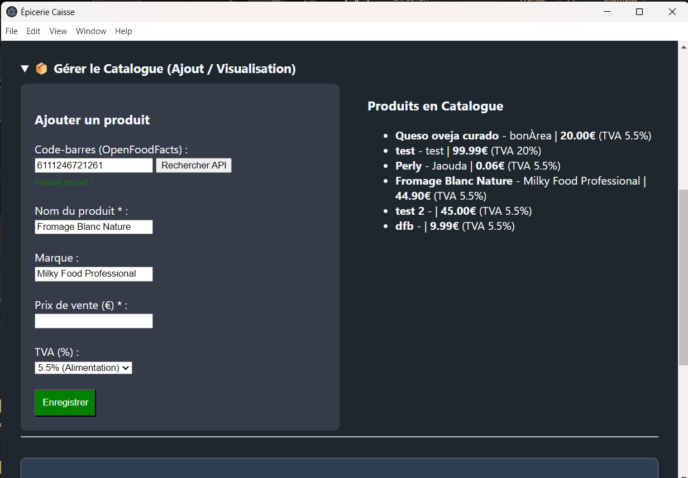
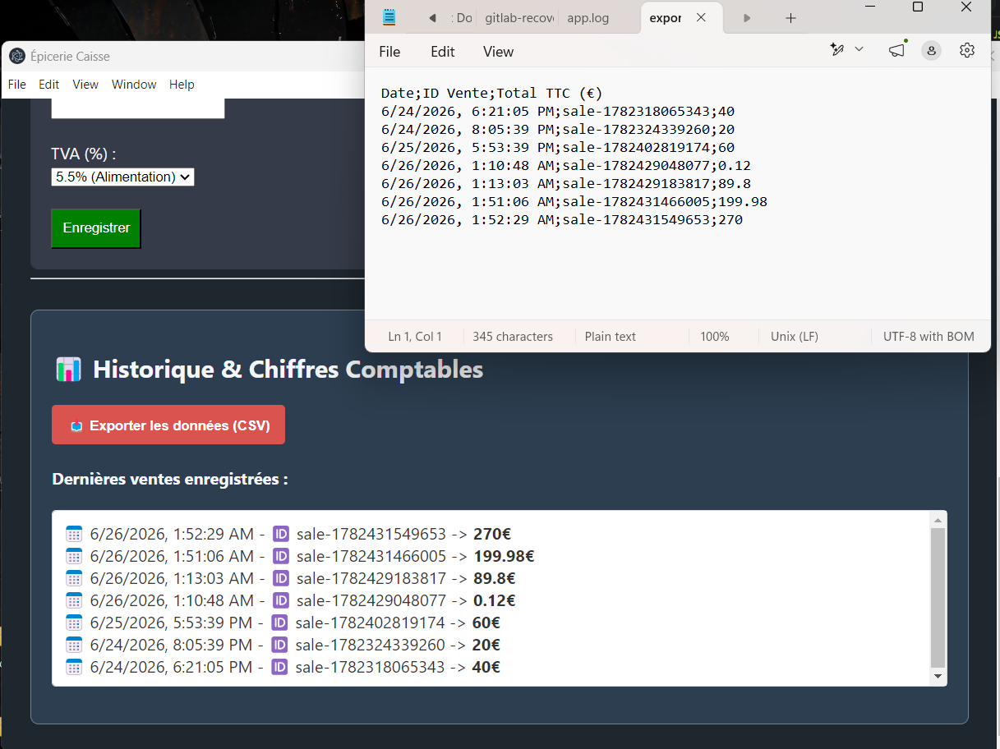
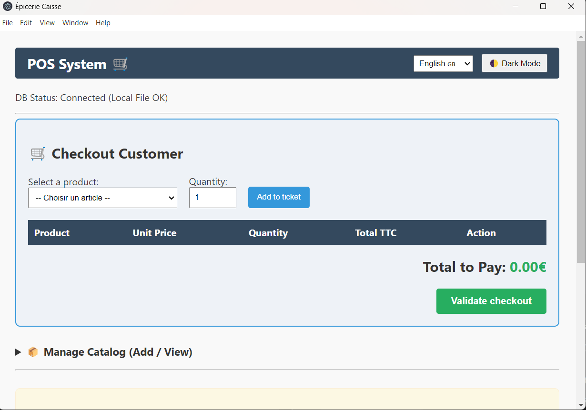

# 🛒 Logiciel de Caisse pour Épicerie de Quartier

Application de caisse enregistreuse Desktop moderne, robuste et sécurisée conçue avec **Electron**, intégrant l'API **OpenFoodFacts** et fonctionnant à 100% en mode déconnecté (Offline-First).

## ✨ Fonctionnalités

- **Encaissement Rapide** : Gestion d'un panier virtuel, modification des quantités, calcul du total TTC en temps réel et validation de la vente.
- **Gestion du Catalogue** : Double logique d'ajout. Scan de code-barres avec auto-complétion via l'API OpenFoodFacts ou saisie manuelle (idéal en cas de coupure Internet).
- **Historique & Comptabilité** : Visualisation des dernières transactions et export instantané des données au format CSV structuré pour le comptable.
- **Expérience Utilisateur (UX)** : Entièrement bilingue (Français/Anglais) avec mémorisation des préférences et support du Mode Sombre pour le confort visuel de la gérante.
- **Sécurité Maximale** : Sandbox activée, isolation des contextes respectée, aucune fuite de privilèges Node.js dans l'interface utilisateur.

---

## 🛠️ Installation et Lancement (Développement)

### Prérequis

Avoir installé Node.js (Version 18+).

### Étape 1 : Cloner le projet et installer les dépendances

Exécute la commande suivante dans ton terminal :
`npm install`

### Étape 2 : Lancer les tests unitaires (Logique Métier)

Pour vérifier l'exactitude des calculs comptables du panier :
`npm test`

### Étape 3 : Lancer l'application en mode développement:

`npm start`

---

## 📦 Production : Générer l'Installeur Client

Pour livrer l'application sous forme de fichier exécutable autonome (Installeur graphique) pour la gérante :
`npm run dist`

L'installeur (ex: .exe pour Windows ou .dmg pour macOS) sera généré dans le dossier /dist. Le client n'aura qu'à double-cliquer dessus pour installer l'application sur sa machine.

---

## 📸 Aperçus du processus d'installation (Windows) et du fonctionnement de l'Application

### 1. Après avoir éxécuté `npm run dist`, un dossier "dist" apparaîtra à la racine du projet; Clique sur le fichier .exe pour démmarrer l'installation

### 2. Un wizard d'installation s'ouvrira; Choisis l'emplacement et clique sur "Install"

### 3. Attends que l'installation finisse

### 4. Clique sur "Finish"

### 5. Vérifie l'installation dans l'emplacement choisi

### 6. Une icône apparaîtra sur ton Desktop; Double clique sur cette icône pour ouvrir l'application

### 7. Séction "Encaisser un client"

### 8. Séction "Ajout / Visualisation"

### 9. Séction "Historique" + export csv

### 10. Anglais & Mode Clair

